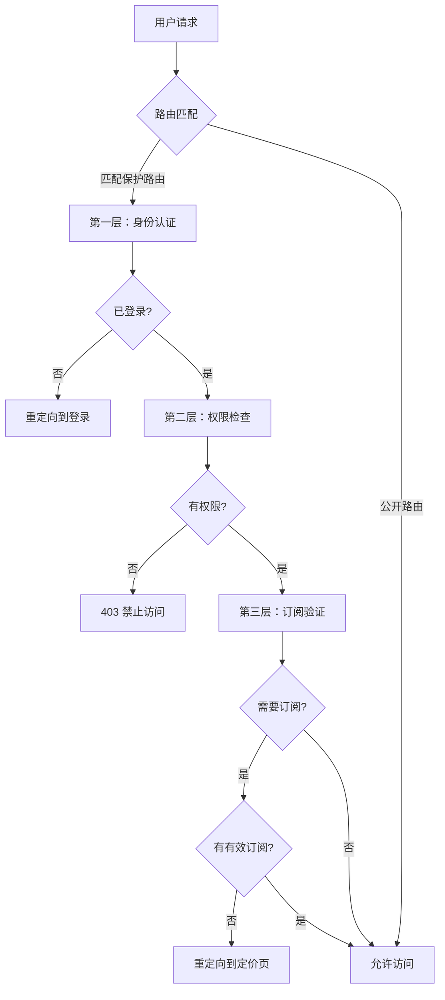
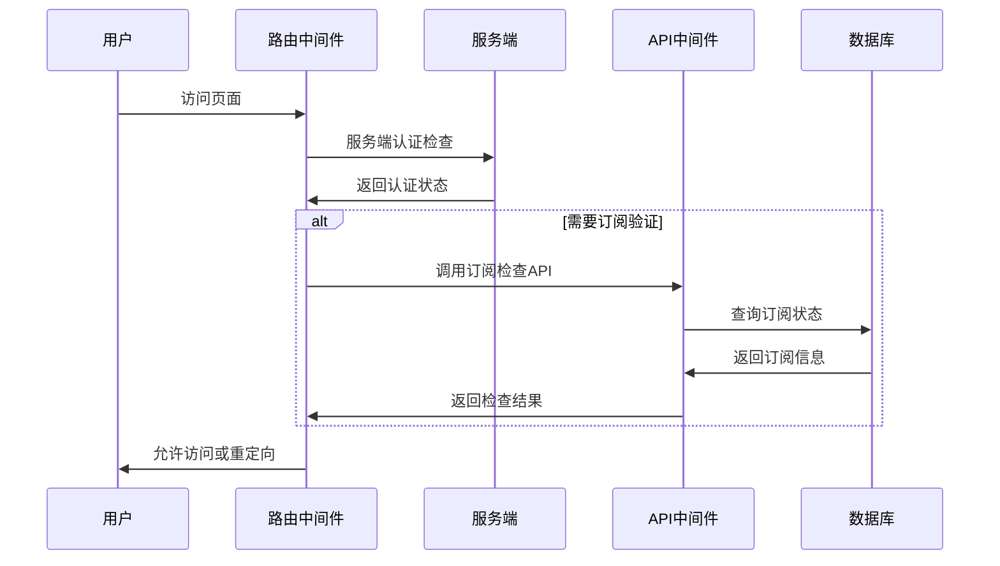

# 认证中间件设计文档

本文档详细介绍 TinyShip 项目中认证中间件的设计和使用方式，包括 Next.js 和 Nuxt.js 两种实现方案。

## 📋 目录

1. [概述](#概述)
2. [架构设计](#架构设计)
3. [Next.js 认证中间件](#nextjs-认证中间件)
4. [Nuxt.js 认证中间件](#nuxtjs-认证中间件)
5. [路由保护配置](#路由保护配置)
6. [权限检查机制](#权限检查机制)
7. [订阅验证](#订阅验证)
8. [使用指南](#使用指南)
9. [最佳实践](#最佳实践)

## 概述

TinyShip 提供了统一的认证中间件设计，支持：

- **多层认证检查** - 身份验证、权限验证、订阅验证
- **框架适配** - Next.js 和 Nuxt.js 两种实现
- **配置驱动** - 通过路由配置控制访问权限
- **性能优化** - 智能重定向和缓存机制

### 核心特性

✅ **统一配置** - 两个框架使用相同的路由保护配置  
✅ **分层验证** - 身份认证 → 权限检查 → 订阅验证  
✅ **智能重定向** - 根据用户状态自动跳转到合适页面  
✅ **国际化支持** - 自动处理多语言路由  
✅ **开发友好** - 详细的日志输出和错误提示  

## 架构设计

### 三层验证模型



### 框架差异

| 特性 | Next.js | Nuxt.js |
|------|---------|---------|
| **实现方式** | 中间件 (middleware.ts) | 路由中间件 + 服务器中间件 |
| **执行时机** | 请求级别 | 页面级别 + API级别 |
| **性能优化** | 边缘计算支持 | 服务端渲染优化 |
| **配置文件** | `authMiddleware.ts` | `auth.global.ts` + `permissions.ts` |

## Next.js 认证中间件

### 文件结构

```bash
apps/next-app/
├── middleware.ts                 # 主中间件入口
└── middlewares/
    ├── authMiddleware.ts        # 认证逻辑
    ├── localeMiddleware.ts      # 国际化处理
```

### 工作流程

1. **请求拦截** - `middleware.ts` 拦截所有页面请求
2. **路由匹配** - 检查是否为保护路由
3. **身份验证** - 使用 Better Auth 验证用户会话
4. **权限检查** - 基于 RBAC 系统验证用户权限
5. **订阅验证** - 检查用户订阅状态（如需要）
6. **智能重定向** - 根据验证结果进行相应处理

### 配置示例

```typescript
// 管理员页面 - 需要管理权限
{
  pattern: new RegExp(`^\\/(${i18n.locales.join('|')})\\/admin(\\/.*)?$`),
  type: 'page',
  requiresAuth: true,
  requiredPermission: { action: Action.MANAGE, subject: Subject.ALL }
},

// 高级功能 - 需要有效订阅
{
  pattern: new RegExp(`^\\/(${i18n.locales.join('|')})\\/premium-features(\\/.*)?$`),
  type: 'page',
  requiresAuth: true,
  requiresSubscription: true
},

// 认证页面 - 已登录用户重定向
{
  pattern: new RegExp(`^\\/(${i18n.locales.join('|')})\\/signin$`),
  type: 'page',
  requiresAuth: false,
  isAuthRoute: true
}
```

### 使用方式

中间件会自动处理所有保护逻辑，开发者只需：

1. **配置路由** - 在 `protectedRoutes` 数组中添加路由配置
2. **创建页面** - 正常创建页面组件，中间件会自动处理权限检查

## Nuxt.js 认证中间件

### 文件结构

```bash
apps/nuxt-app/
├── middleware/
│   └── auth.global.ts           # 全局路由中间件
└── server/middleware/
    └── permissions.ts           # API 权限中间件
```

### 双重保护机制

#### 1. 路由中间件 (`auth.global.ts`)

- **页面级保护** - 保护需要认证的页面路由
- **客户端优化** - 提供良好的用户体验
- **服务端检查** - 关键权限在服务端验证

#### 2. API 中间件 (`permissions.ts`)

- **API 级保护** - 保护服务器 API 端点
- **服务端安全** - 所有 API 调用都经过验证
- **性能优化** - 避免不必要的数据库查询

### 工作流程

#### 页面访问流程




### 使用方式

1. **配置路由** - 在 `protectedRoutes` 数组中添加路由配置
2. **创建页面** - 正常创建页面组件，中间件会自动处理权限检查

## 路由保护配置

### 配置选项详解

| 选项 | 作用 | 示例场景 |
|------|------|----------|
| `pattern` | 匹配需要保护的路由 | `/admin` 匹配管理员页面 |
| `type` | 区分页面和API，决定失败时的响应方式 | 页面重定向，API返回错误码 |
| `requiresAuth` | 是否必须登录才能访问 | 仪表板页面需要登录 |
| `requiredPermission` | 需要特定权限才能访问 | 管理员页面需要管理权限 |
| `requiresSubscription` | 是否需要有效订阅 | 高级功能需要付费订阅 |
| `isAuthRoute` | 已登录用户访问时重定向到仪表板 | 登录页面，注册页面 |
| `redirectIfSubscribed` | 已订阅用户访问时重定向到仪表板 | 定价页面 |

### 常见配置模式

#### 1. 公开页面

```typescript
// 无需任何验证
// 不在 protectedRoutes 中配置即可
```

#### 2. 需要登录的页面

```typescript
{
  pattern: /^\/dashboard$/,
  type: 'page',
  requiresAuth: true
}
```

#### 3. 管理员专用页面

```typescript
{
  pattern: /^\/admin/,
  type: 'page',
  requiresAuth: true,
  requiredPermission: { action: Action.MANAGE, subject: Subject.ALL }
}
```

#### 4. 付费功能页面

```typescript
{
  pattern: /^\/premium/,
  type: 'page',
  requiresAuth: true,
  requiresSubscription: true
}
```

#### 5. 认证页面（已登录重定向）

```typescript
{
  pattern: /^\/signin$/,
  type: 'page',
  requiresAuth: false,
  isAuthRoute: true  // 已登录用户访问时重定向到仪表板
}
```

#### 6. 定价页面（已付费重定向）

```typescript
{
  pattern: /^\/pricing$/,
  type: 'page',
  requiresAuth: false,
  redirectIfSubscribed: true  // 已订阅用户重定向到仪表板
}
```

## 权限检查机制

### RBAC 权限模型

TinyShip 使用基于角色的访问控制（RBAC）：

```typescript
// 权限检查示例
can(user, Action.MANAGE, Subject.ALL)  // 管理所有资源
can(user, Action.READ, Subject.USER)   // 读取用户信息
can(user, Action.CREATE, Subject.ORDER) // 创建订单
```


## 使用指南

### 添加新的保护路由

#### 1. 确定保护级别
- **仅需登录** - 设置 `requiresAuth: true`
- **需要特定权限** - 添加 `requiredPermission`
- **需要付费订阅** - 设置 `requiresSubscription: true`

#### 2. 在 protectedRoutes 数组中添加配置

```typescript
{
  pattern: new RegExp(`^\\/(${locales.join('|')})\\/your-feature(\\/.*)?$`),
  type: 'page',
  requiresAuth: true,
  requiresSubscription: true  // 如果是付费功能
}
```

#### 3. 创建对应的页面
创建页面后，中间件会自动根据配置进行权限检查和重定向。

## 最佳实践

### 配置建议

- **最小权限** - 只授予必需的最小权限
- **统一配置** - 将所有路由保护规则集中在 `protectedRoutes` 数组中
- **类型安全** - 使用 TypeScript 确保配置正确
- **测试验证** - 配置后测试各种用户状态下的访问情况

### 权限设计

- **分层验证** - 中间件处理通用权限，页面内处理具体业务权限
- **服务端优先** - 重要权限检查在服务端进行
- **清晰重定向** - 根据用户状态智能重定向到合适页面

## 总结

TinyShip 的认证中间件设计提供了：

- **统一体验** - Next.js 和 Nuxt.js 保持一致的权限模型
- **灵活配置** - 支持各种权限控制需求
- **高性能** - 优化的检查流程和缓存策略
- **安全可靠** - 多层验证确保系统安全
- **开发友好** - 简单的配置和清晰的文档

通过合理配置和使用认证中间件，您可以快速构建安全、高效的 SaaS 应用程序。
