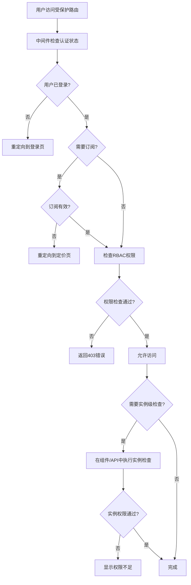

# Nuxt.js RBAC 权限系统架构文档

> **基于 `@libs/permissions` 的完整 RBAC 实现**
> 
> **创建时间**: 2024-12-19
> **适用版本**: Nuxt 3 + Vue 3 + Better-Auth

## 🔒 系统概述

本文档描述了 Nuxt.js 应用中基于 `@libs/permissions` 库实现的角色基访问控制(RBAC)系统。该系统与 Next.js 版本的权限控制完全对等，提供了多层次的权限检查和保护机制。

## 🏗️ 核心组件架构

### 1. 客户端中间件 (`middleware/auth.global.ts`)

**功能特性:**
- 基于 `@libs/permissions` 的 RBAC 系统
- 支持角色权限检查 (Action + Subject)
- 订阅状态验证
- 智能重定向 (登录页/定价页)

**保护路由配置:**
```typescript
const protectedRoutes: ProtectedRouteConfig[] = [
  // Admin routes - require admin permissions
  {
    pattern: /^\/admin(\/.*)?$/,
    type: 'page',
    requiredPermission: { action: Action.MANAGE, subject: Subject.ALL }
  },
  
  // Premium features - require active subscription
  {
    pattern: /^\/premium-features(\/.*)?$/,
    type: 'page',
    requiresSubscription: true
  }
]
```

### 2. 服务端中间件 (`server/middleware/permissions.ts`)

**功能特性:**
- API 路由保护
- 会话验证和用户上下文注入
- 与客户端中间件一致的权限规则

**API 路由保护:**
```typescript
const protectedApiRoutes: ProtectedApiRouteConfig[] = [
  // Admin API routes - require admin permissions
  {
    pattern: /^\/api\/admin\/(.*)?$/,
    requiredPermission: { action: Action.MANAGE, subject: Subject.ALL }
  },
  
  // Premium API routes - require active subscription
  {
    pattern: /^\/api\/premium(\/.*)?$/,
    requiresSubscription: true
  }
]
```

### 3. Vue Composables (`composables/usePermissions.ts`)

**提供的功能:**
- `usePermission(user, action, subject, data?)` - 权限检查
- `useAvailableActions(user, subject)` - 可用操作列表
- `useAbility(user)` - 高级权限接口
- `useAppUser(user)` - 用户类型转换

**使用示例:**
```vue
<script setup>
import { Action, Subject } from '@libs/permissions'
import { usePermission } from '@/composables/usePermissions'

const { user } = useAuth()
const canEditProfile = usePermission(user, Action.UPDATE, Subject.USER)
</script>

<template>
  <div>
    <Button v-if="canEditProfile" @click="editProfile">
      编辑资料
    </Button>
  </div>
</template>
```

### 4. 组件级保护 (`components/PermissionGuard.vue`)

**功能特性:**
- 条件渲染受保护内容
- 自定义回退内容支持
- 实例级权限检查

**使用示例:**
```vue
<!-- 基础用法 -->
<PermissionGuard :action="Action.READ" :subject="Subject.ADMIN_PANEL">
  <AdminDashboard />
</PermissionGuard>

<!-- 自定义回退内容 -->
<PermissionGuard :action="Action.UPDATE" :subject="Subject.USER" :data="{ id: userId }">
  <UserEditForm />
  <template #fallback>
    <div class="bg-yellow-50 border border-yellow-200 rounded-md p-4">
      <p class="text-yellow-800">您只能编辑自己的资料。</p>
    </div>
  </template>
</PermissionGuard>

<!-- 实例特定权限检查 -->
<PermissionGuard :action="Action.UPDATE" :subject="Subject.ARTICLE" :data="article">
  <EditArticleButton />
</PermissionGuard>

<!-- 管理员专用内容 -->
<PermissionGuard :action="Action.MANAGE" :subject="Subject.ALL">
  <AdminSettings />
  <template #fallback>
    <p>需要管理员权限才能访问此内容。</p>
  </template>
</PermissionGuard>
```

## 🔐 权限检查层级

### 第一层：中间件权限检查
**位置:** 路由中间件 (`middleware/auth.global.ts`, `server/middleware/permissions.ts`)
**作用:** 一般性权限检查
**示例:** `can(user, Action.UPDATE, Subject.ARTICLE)`

### 第二层：实例权限检查
**位置:** 组件内部或 API 路由处理器
**作用:** 实例特定权限检查
**示例:** `can(user, Action.UPDATE, Subject.ARTICLE, specificArticle)`

## 🎯 权限检查流程



## 🔧 支持的功能特性

### ✅ 角色基权限控制
- **Admin**: 全系统管理权限
- **VIP**: 高级功能访问权限
- **Normal**: 基础功能权限

### ✅ 资源级访问控制
- **User**: 用户资料管理
- **Article**: 文章内容管理
- **Admin Panel**: 管理后台访问
- **Chat Message**: 聊天消息权限
- **Subscription**: 订阅管理

### ✅ 订阅状态验证
- 实时订阅状态检查
- 自动重定向到定价页
- 优雅的订阅过期处理

### ✅ 动态权限检查
- 运行时权限计算
- 响应式权限状态
- 实例级权限判断

### ✅ 优雅的权限不足处理
- 自定义错误页面
- 回退内容显示
- 用户友好的提示信息

### ✅ 组件级条件渲染
- 声明式权限控制
- 插槽支持
- 灵活的内容替换

### ✅ 服务端 API 保护
- 请求级权限验证
- 用户上下文注入
- 统一的错误响应

## 🔄 与 Next.js 实现对等性

### ✅ 相同的保护路由配置
- 路由模式完全一致
- 权限要求相同
- 重定向逻辑一致

### ✅ 相同的权限检查逻辑
- 使用相同的 `@libs/permissions` 库
- Action 和 Subject 定义一致
- 权限计算逻辑相同

### ✅ 相同的重定向行为
- 未登录 → 登录页
- 订阅过期 → 定价页
- 权限不足 → 403 错误

### ✅ 相同的错误处理机制
- 统一的错误响应格式
- 一致的状态码使用
- 相同的用户提示信息

## 🛠️ 开发指南

### 添加新的受保护路由

1. **客户端路由保护:**
```typescript
// middleware/auth.global.ts
const protectedRoutes: ProtectedRouteConfig[] = [
  // 添加新路由
  {
    pattern: /^\/new-feature(\/.*)?$/,
    type: 'page',
    requiredPermission: { action: Action.READ, subject: Subject.NEW_FEATURE }
  }
]
```

2. **API 路由保护:**
```typescript
// server/middleware/permissions.ts
const protectedApiRoutes: ProtectedApiRouteConfig[] = [
  // 添加新API
  {
    pattern: /^\/api\/new-feature(\/.*)?$/,
    requiredPermission: { action: Action.CREATE, subject: Subject.NEW_FEATURE }
  }
]
```

### 实现实例级权限检查

**在 API 路由中:**
```typescript
// server/api/articles/[id].delete.ts
export default defineEventHandler(async (event) => {
  // 用户已通过中间件认证和基础权限检查
  const user = event.context.user
  const articleId = getRouterParam(event, 'id')

  // 获取特定资源
  const article = await db.article.findUnique({ where: { id: articleId } })
  if (!article) {
    throw createError({ statusCode: 404, statusMessage: 'Article not found' })
  }

  // 实例特定权限检查
  const appUser = createAppUser(user)
  const hasPermission = can(appUser, Action.DELETE, Subject.ARTICLE, article)

  if (!hasPermission) {
    throw createError({ statusCode: 403, statusMessage: 'Forbidden' })
  }

  // 执行操作
  await db.article.delete({ where: { id: articleId } })
  return { success: true }
})
```

**在 Vue 组件中:**
```vue
<script setup>
import { usePermission } from '@/composables/usePermissions'

const props = defineProps<{ article: Article }>()
const { user } = useAuth()

// 检查是否可以编辑这篇具体的文章
const canEditThisArticle = usePermission(
  user, 
  Action.UPDATE, 
  Subject.ARTICLE, 
  props.article
)
</script>

<template>
  <div>
    <h1>{{ article.title }}</h1>
    <Button v-if="canEditThisArticle" @click="editArticle">
      编辑文章
    </Button>
  </div>
</template>
```

## 🔍 调试和故障排除

### 权限检查日志
系统在开发模式下会输出详细的权限检查日志：

```
Protected route accessed: /admin/users, Type: page
Authentication successful for: /admin/users, User: user-123
Authorization successful (permissions check passed) for user user-123 on /admin/users
```

### 常见问题

1. **权限检查失败**
   - 检查用户角色是否正确映射
   - 验证 Action 和 Subject 是否在 `@libs/permissions` 中定义
   - 确认权限规则是否正确配置

2. **订阅检查失败**
   - 实现 `hasValidSubscription()` 函数
   - 检查订阅状态查询逻辑
   - 验证订阅数据格式

3. **重定向循环**
   - 检查公共路由配置
   - 验证中间件跳过条件
   - 确认登录页和定价页不在保护列表中

## 📝 最佳实践

1. **权限粒度控制**: 合理设计 Action 和 Subject，避免过于细粒度或过于粗粒度
2. **性能优化**: 在组件中缓存权限检查结果，避免重复计算
3. **用户体验**: 提供清晰的权限不足提示和引导
4. **安全性**: 始终在服务端验证权限，客户端权限检查仅用于UI优化
5. **可维护性**: 集中管理权限配置，避免分散在各个文件中

---

**文档版本**: v1.0  
**最后更新**: 2024-12-19  
**维护者**: 开发团队 