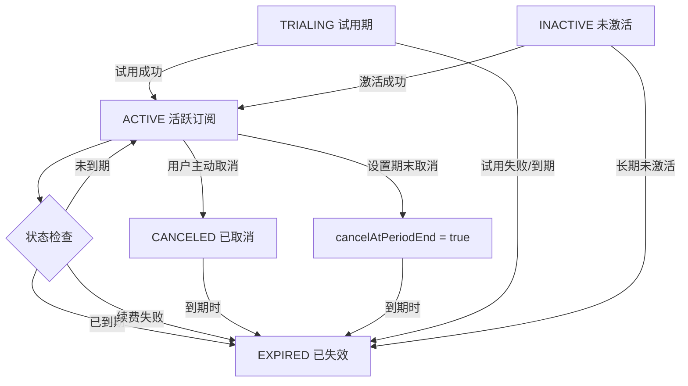

# Payment System Technical Details

## 概述

本文档详细描述了ShipEasy支付系统的技术实现，包括：
- **传统订阅模式**：按时间计费（月付/年付/终身），支持循环订阅和一次性支付
- **积分模式**：AI时代流行的按需付费模式，用户购买积分包后按实际使用量消耗

系统支持 Stripe、Creem、微信支付 三个支付提供商，可灵活配置不同的计费模式。

## 架构设计

### 双模式支付体系

```
┌─────────────────────────────────────────────────────────────┐
│                     ShipEasy Payment System                  │
├─────────────────────────────┬───────────────────────────────┤
│      订阅模式 (Subscription)  │       积分模式 (Credits)        │
├─────────────────────────────┼───────────────────────────────┤
│  • 月付/年付/终身             │  • 一次性购买积分包              │
│  • 订阅期内无限使用           │  • 按实际使用量消费积分          │
│  • 自动续费或手动续费         │  • 积分永不过期                 │
│  • 适合高频用户               │  • 适合轻度/偶尔使用用户         │
└─────────────────────────────┴───────────────────────────────┘
```

### 统一接口设计
三个支付提供商都实现了相同的接口：
- `createPayment()` - 创建支付会话
- `handleWebhook()` - 处理webhook事件
- `verifyPayment()` - 验证支付状态

### 数据模型
系统使用三个主要数据表：
- **Orders表** - 记录所有支付订单（订阅和积分购买）
- **Subscriptions表** - 记录订阅关系和状态
- **CreditTransactions表** - 记录积分变动明细（充值、消费、赠送等）

### 用户余额管理
- **User表** 新增 `creditBalance` 字段存储用户当前积分余额
- 所有积分操作通过 `@libs/credits` 服务统一管理，确保事务安全

## Stripe Webhook事件处理

### 事件分发逻辑
```typescript
switch (event.type) {
  case 'checkout.session.completed':
    // 根据session.mode区分订阅和一次性支付
    if (session.mode === 'subscription') {
      return this.handleSubscriptionCreated(session);
    } else {
      return this.handleOneTimePayment(session);
    }
  
  case 'customer.subscription.updated':
    // 处理订阅更新（续费、计划变更等）
    return this.handleSubscriptionUpdated(subscription);
  
  case 'customer.subscription.deleted':
    // 处理订阅删除
    return this.handleSubscriptionDeleted(subscription);
}
```

### 1. checkout.session.completed - 支付完成

#### 订阅支付 (`session.mode === 'subscription'`)

**触发条件**：用户完成Stripe订阅支付
**处理流程**：

1. **数据提取**
   ```typescript
   const subscription = await this.stripe.subscriptions.retrieve(session.subscription);
   const periodStart = new Date(subscriptionItem.current_period_start * 1000);
   const periodEnd = new Date(subscriptionItem.current_period_end * 1000);
   ```

2. **订单状态更新**
   ```typescript
   await db.update(order)
     .set({ status: orderStatus.PAID })
     .where(eq(order.id, session.metadata.orderId));
   ```

3. **创建订阅记录**
   ```typescript
   await db.insert(userSubscription).values({
     id: randomUUID(),
     userId: session.metadata.userId,
     planId: session.metadata.planId,
     status: subscriptionStatus.ACTIVE,
     paymentType: paymentTypes.RECURRING,
     stripeCustomerId: session.customer,
     stripeSubscriptionId: subscription.id,
     periodStart: periodStart,
     periodEnd: periodEnd,
     cancelAtPeriodEnd: false
   });
   ```

#### 一次性支付 (`session.mode === 'payment'`)

**触发条件**：用户完成一次性支付（如终身会员）
**处理流程**：

1. **时间计算**
   ```typescript
   const plan = config.payment.plans[session.metadata.planId];
   const isLifetime = plan.duration.months >= 9999;
   
   let periodEnd;
   if (isLifetime) {
     periodEnd = new Date(now);
     periodEnd.setFullYear(periodEnd.getFullYear() + 100);
   } else {
     periodEnd = new Date(now);
     periodEnd.setMonth(periodEnd.getMonth() + plan.duration.months);
   }
   ```

2. **创建一次性订阅**
   ```typescript
   await db.insert(userSubscription).values({
     // ... 基本字段
     paymentType: paymentTypes.ONE_TIME,
     cancelAtPeriodEnd: true, // 一次性支付不会自动续费
     periodEnd: periodEnd
   });
   ```

### 2. customer.subscription.updated - 订阅更新

**触发条件**：
- 订阅续费成功
- 用户升级/降级计划
- 订阅状态变更

**处理逻辑**：

1. **查找订阅记录**（通过stripeCustomerId而非subscriptionId）
   ```typescript
   const existingSubscription = await db.query.subscription.findFirst({
     where: eq(userSubscription.stripeCustomerId, stripeCustomerId)
   });
   ```

2. **计划识别**
   ```typescript
   const priceId = subscriptionItem.price.id;
   let newPlanId = existingSubscription.planId;
   
   for (const [planId, planDetails] of Object.entries(config.payment.plans)) {
     if (planDetails.provider === 'stripe' && planDetails.stripePriceId === priceId) {
       newPlanId = planId;
       break;
     }
   }
   ```

3. **更新订阅信息**
   ```typescript
   await db.update(userSubscription)
     .set({
       status: this.mapStripeStatus(stripeSubscription.status),
       planId: newPlanId,
       stripeSubscriptionId: stripeSubscription.id,
       periodStart: periodStart,
       periodEnd: periodEnd,
       cancelAtPeriodEnd: stripeSubscription.cancel_at_period_end
     })
     .where(eq(userSubscription.stripeCustomerId, stripeCustomerId));
   ```

### 3. customer.subscription.deleted - 订阅删除

**触发条件**：用户取消订阅且立即生效
**处理逻辑**：
```typescript
await db.update(userSubscription)
  .set({
    status: subscriptionStatus.CANCELED,
    updatedAt: new Date()
  })
  .where(eq(userSubscription.stripeSubscriptionId, stripeSubscription.id));
```

## Creem Webhook事件处理

### 事件分发逻辑
```typescript
switch (webhookData.eventType) {
  case 'checkout.completed':
    // 主要事件：处理所有新订单/订阅创建
    return this.handleCheckoutCompleted(webhookData);
  
  case 'subscription.paid':
    // 续费事件：处理订阅续费（非首次付款）
    return this.handleSubscriptionRenewal(webhookData);
  
  case 'subscription.update':
    // 订阅变更：处理计划升级/降级等
    return this.handleSubscriptionUpdate(webhookData);
  
  case 'subscription.canceled':
    // 订阅取消
    return this.handleSubscriptionCanceled(webhookData);
  
  case 'subscription.expired':
    // 订阅过期
    return this.handleSubscriptionExpired(webhookData);
}
```

### 1. checkout.completed - 支付完成

**触发条件**：用户完成Creem支付
**处理流程**：

1. **元数据验证**
   ```typescript
   const { orderId, userId, planId } = webhookData.object.metadata;
   ```

2. **订单状态更新**
   ```typescript
   await db.update(order)
     .set({ 
       status: orderStatus.PAID,
       metadata: JSON.stringify({
         checkoutId: webhookData.object.id
       })
     })
     .where(eq(order.id, orderId));
   ```

3. **订阅类型判断和创建**

   **循环订阅**：
   ```typescript
   if (plan.duration.type === 'recurring') {
     // 优先使用Creem提供的周期信息，如果没有则fallback到计算方式
     let periodStart: Date;
     let periodEnd: Date;
     
     if (webhookData.object.subscription?.current_period_start_date && webhookData.object.subscription?.current_period_end_date) {
       // 使用Creem提供的准确周期信息（从subscription对象中获取）
       periodStart = new Date(webhookData.object.subscription.current_period_start_date);
       periodEnd = new Date(webhookData.object.subscription.current_period_end_date);
     } else {
       // Fallback: 基于当前时间和计划配置计算周期
       const now = utcNow();
       periodStart = now;
       periodEnd = new Date(now);
       periodEnd.setMonth(periodEnd.getMonth() + plan.duration.months);
     }

     const subscriptionData = {
       // ... 基本字段
       paymentType: paymentTypes.RECURRING,
       creemCustomerId: typeof webhookData.object.customer === 'string' 
         ? webhookData.object.customer 
         : webhookData.object.customer?.id || null,
       creemSubscriptionId: webhookData.object.subscription?.id || null,
       periodStart: periodStart,
       periodEnd: periodEnd,
       cancelAtPeriodEnd: false
     };
     await db.insert(userSubscription).values(subscriptionData);
   }
   ```

   **一次性支付**：
   ```typescript
   else {
     const isLifetime = plan.duration.months >= 9999;
     let periodEnd = new Date(now);
     
     if (isLifetime) {
       periodEnd.setFullYear(periodEnd.getFullYear() + 100);
     } else {
       periodEnd.setMonth(periodEnd.getMonth() + plan.duration.months);
     }
     
     const oneTimeSubscriptionData = {
       // ... 基本字段
       paymentType: paymentTypes.ONE_TIME,
       cancelAtPeriodEnd: true
     };
   }
   ```

### 2. subscription.paid - 订阅续费

**触发条件**：订阅自动续费成功（非首次付款）
**处理逻辑**：

1. **查找订阅记录**
   ```typescript
   const subscription = await db.query.subscription.findFirst({
     where: eq(userSubscription.creemSubscriptionId, subscriptionId)
   });
   ```

2. **获取准确的订阅周期信息**
   ```typescript
   // 从Creem webhook获取准确的订阅周期信息
   const periodStartStr = webhookData.object.current_period_start_date;
   const periodEndStr = webhookData.object.current_period_end_date;
   
   const newPeriodStart = new Date(periodStartStr);
   const newPeriodEnd = new Date(periodEndStr);
   ```

3. **更新订阅状态和周期**
   ```typescript
   await db.update(userSubscription)
     .set({
       status: subscriptionStatus.ACTIVE,
       periodStart: newPeriodStart,
       periodEnd: newPeriodEnd,
       updatedAt: new Date()
     })
     .where(eq(userSubscription.id, subscription.id));
   ```

**注意**：
- 首次付款会在`checkout.completed`事件中处理，此事件仅处理续费
- Creem的`subscription.paid` webhook包含完整的周期信息（current_period_start_date, current_period_end_date）
- 直接使用Creem提供的准确时间戳，确保与Creem后台数据一致

### 3. subscription.update - 订阅更新

**触发条件**：订阅计划变更、状态更新
**处理逻辑**：
```typescript
await db.update(userSubscription)
  .set({
    status: this.mapCreemStatus(webhookData.object.status || 'active'),
    updatedAt: new Date()
  })
  .where(eq(userSubscription.id, subscription.id));
```

### 4. subscription.canceled - 订阅取消

**触发条件**：用户主动取消订阅
**处理逻辑**：
```typescript
await db.update(userSubscription)
  .set({
    cancelAtPeriodEnd: true,  // 设置期末取消，用户仍可使用到期末
    updatedAt: new Date()
  })
  .where(eq(userSubscription.id, subscription.id));
```

**注意**：不立即更改status，用户可继续使用到当前周期结束。

### 5. subscription.expired - 订阅过期

**触发条件**：订阅到期或支付失败导致过期
**处理逻辑**：
```typescript
await db.update(userSubscription)
  .set({
    status: subscriptionStatus.EXPIRED,
    updatedAt: new Date()
  })
  .where(eq(userSubscription.id, subscription.id));
```

## 时区处理机制

### 背景问题

在处理全球化支付系统时，时区问题是一个关键挑战：

1. **Webhook时间**: Stripe和Creem返回的都是UTC时间
2. **服务器时间**: `new Date()` 返回服务器本地时区时间
3. **数据一致性**: 数据库中出现时间不一致的问题

**实际问题示例**：
```
订阅开始时间: 2025-09-15 13:35:22.569  (来自Creem webhook - UTC)
创建时间:    2025-09-15 21:35:22.577  (服务器new Date() - UTC+8)
时间差异:    8小时
```

### 解决方案设计

#### 核心原则：最小化修改

**分析**：
- ✅ Stripe Unix时间戳本身就是UTC
- ✅ Creem ISO 8601字符串本身就是UTC  
- ❌ 问题只在服务器本地时间获取

**策略**：
- 保持webhook时间处理逻辑不变（本身正确）
- 只修改服务器"当前时间"的获取方式

#### 实现细节

**1. UTC工具函数**
```typescript
// libs/database/utils/utc.ts
export function utcNow(): Date {
  return new Date(Date.now()); // Date.now()返回UTC毫秒数，确保时区无关
}
```

**2. 应用场景**
```typescript
// 订阅过期检查
const now = utcNow(); // 替代 new Date()
if (subscription.periodEnd < now) {
  await db.update(subscription).set({
    status: subscriptionStatus.EXPIRED,
    updatedAt: now // 使用相同的UTC时间
  });
}

// 一次性支付处理
const now = utcNow(); // 确保与webhook时间一致
const periodEnd = new Date(now);
periodEnd.setMonth(periodEnd.getMonth() + plan.duration.months);
```

**3. Webhook处理保持不变**
```typescript
// Stripe - 保持原有逻辑
const periodStart = new Date(subscriptionItem.current_period_start * 1000);
const periodEnd = new Date(subscriptionItem.current_period_end * 1000);

// Creem - 保持原有逻辑  
const periodStart = new Date(webhookData.object.subscription.current_period_start_date);
const periodEnd = new Date(webhookData.object.subscription.current_period_end_date);
```

### 效果验证

**修复前**：
```
订阅开始: 2025-09-15 13:35:22.569  (webhook UTC)
创建时间: 2025-09-15 21:35:22.577  (服务器 UTC+8)
差异:     8小时 ❌
```

**修复后**：
```
订阅开始: 2025-09-15 13:35:22.569  (webhook UTC)
创建时间: 2025-09-15 13:35:22.577  (utcNow() UTC)
差异:     0小时 ✅
```

### 时间字段分类策略

系统对不同用途的时间字段采用分类处理策略：

#### **业务逻辑时间**（精确计算）
- **字段**: `periodStart`, `periodEnd`
- **处理**: 使用 `utcNow()` 确保与webhook时间一致
- **用途**: 订阅过期判断、业务逻辑计算

#### **审计日志时间**（记录追踪）  
- **字段**: `createdAt`, `updatedAt`
- **处理**: 使用 `new Date()` 保持schema默认行为
- **用途**: 数据变更追踪、audit log

#### **数据库Schema保持**
- **业务表**: subscription/order使用 `TIMESTAMP WITHOUT TIME ZONE`
- **用户表**: user表保持 `TIMESTAMP WITH TIME ZONE`（避免数据迁移风险）
- **存储格式**: 应用层确保UTC时间一致性
- **应用层控制**: 在代码中明确处理时区转换

### 优势总结

1. **分类清晰**: 业务时间vs审计时间，用途明确
2. **最小改动**: 只修改业务逻辑相关的时间处理
3. **风险最低**: webhook逻辑完全不变，schema保持一致
4. **维护简单**: 不同用途使用不同策略，逻辑清晰
5. **全球兼容**: 支持任意时区的服务器部署

## 订阅到期处理机制

系统采用**实时检查为主 + Webhook为辅**的混合策略来处理订阅到期，确保用户权限的准确性和实时性。

### 策略概述

我们的双重保障机制：
1. **实时检查（主要）**: 每次权限验证时检查，100%准确
2. **Webhook事件（辅助）**: 外部服务通知状态变更，提供及时性

### 订阅到期检查方式

#### 1. 实时检查（主要方式）

**触发位置**：`libs/database/utils/subscription.ts - checkSubscriptionStatus()`

**触发时机**：
- 用户访问需要订阅权限的页面
- API接口验证用户权限时
- 用户查看订阅状态时

**处理逻辑**：
```typescript
export async function checkSubscriptionStatus(userId: string) {
  // 获取用户的活跃订阅
  const userSub = await db.select()
    .from(subscription)
    .where(
      and(
        eq(subscription.userId, userId),
        eq(subscription.status, subscriptionStatus.ACTIVE)
      )
    )
    .limit(1);

  if (!userSub.length) return null;

  const sub = userSub[0];
  
  // 检查是否为终身订阅
  const metadata = sub.metadata ? JSON.parse(sub.metadata) : {};
  if (metadata.isLifetime) {
    return { ...sub, isLifetime: true };
  }

  // 实时检查是否过期
  if (sub.periodEnd < utcNow()) {
    // 立即更新过期状态（区分过期和取消）
    await db.update(subscription)
      .set({ 
        status: subscriptionStatus.EXPIRED,  // 使用EXPIRED而不是CANCELED
        updatedAt: new Date()
      })
      .where(eq(subscription.id, sub.id));
    
    return null; // 返回null表示无有效订阅
  }

  return sub; // 返回有效订阅
}
```

**优势**：
- ✅ **零延迟** - 用户访问时立即检查，无状态延迟
- ✅ **准确性高** - 基于实际时间判断，不依赖外部事件
- ✅ **自动修复** - 发现过期立即更新状态
- ✅ **兼容所有支付方式** - 不依赖特定支付平台的webhook

#### 2. Webhook驱动更新（辅助方式）

**Creem平台专用**：
```typescript
// subscription.expired事件处理
case 'subscription.expired':
  await db.update(userSubscription)
    .set({
      status: subscriptionStatus.EXPIRED, // 使用EXPIRED状态表示订阅过期
      updatedAt: new Date()
    })
    .where(eq(userSubscription.id, subscription.id));
```

**Stripe平台**：
通过`customer.subscription.updated`事件处理状态变更：
```typescript
// 当Stripe subscription状态变更时（包括canceled、past_due、unpaid等）
await db.update(userSubscription)
  .set({
    status: this.mapStripeStatus(stripeSubscription.status), // 映射为CANCELED或EXPIRED
    updatedAt: new Date()
  })
  .where(eq(userSubscription.stripeCustomerId, stripeCustomerId));

// mapStripeStatus映射规则：
// 'canceled' → CANCELED (用户主动取消)
// 'past_due' → EXPIRED (付款逾期)
// 'unpaid' → EXPIRED (付款失败)
```

### 订阅状态生命周期



### 不同订阅类型的到期处理

#### 循环订阅 (RECURRING)
- **正常续费**：通过webhook自动更新`periodEnd`
- **续费失败**：状态直接变更为`EXPIRED`
- **用户取消**：设置`cancelAtPeriodEnd = true`，期末自动过期

#### 一次性订阅 (ONE_TIME)
- **创建时设置**：`cancelAtPeriodEnd = true`
- **到期处理**：实时检查发现过期时更新状态
- **终身订阅**：`periodEnd`设置为100年后，实际不会过期

#### 微信支付特殊处理
```typescript
// 微信支付支持订阅延期
if (existingSubscription) {
  const extensionStart = existingSubscription.periodEnd > now 
    ? existingSubscription.periodEnd  // 在现有期限基础上延长
    : now;                           // 已过期则从现在开始
  
  const extensionEnd = new Date(extensionStart);
  extensionEnd.setMonth(extensionEnd.getMonth() + plan.duration.months);
  
  await db.update(subscription)
    .set({ periodEnd: extensionEnd })
    .where(eq(subscription.id, existingSubscription.id));
}
```

### 边界情况处理

#### 1. 时区一致性

系统已通过 `utcNow()` 工具函数解决时区问题，详见上方"时区处理机制"章节。

**核心要点**：
- 使用 `utcNow()` 替代 `new Date()` 获取当前时间
- Webhook时间处理保持不变（本身就是UTC）
- 确保数据库中所有时间字段的一致性

#### 2. 并发访问
- 数据库层面的原子更新操作
- 状态检查后立即更新，避免竞态条件

#### 3. Webhook延迟
- 实时检查作为主要机制，不依赖webhook及时性
- Webhook更新作为辅助，确保数据一致性

#### 4. 系统故障恢复
- 重启后用户首次访问时自动修正过期状态
- 无需额外的数据修复任务

### 性能考虑

#### 优化策略
1. **索引优化**：为`userId + status`创建复合索引
2. **查询限制**：使用`limit(1)`减少不必要的数据传输
3. **缓存策略**：可在应用层添加短期缓存（如5分钟）
4. **批量检查**：避免循环中多次数据库调用

#### 监控指标
- 订阅状态检查频率
- 过期订阅自动更新数量
- Webhook事件处理延迟
- 状态不一致的发生频率

## 订阅状态详解

### 状态含义定义

```typescript
export const subscriptionStatus = {
  ACTIVE: "active",           // 活跃订阅 - 用户可正常使用服务
  CANCELED: "canceled",       // 已取消 - 用户主动取消，可能仍在有效期内
  EXPIRED: "expired",         // 已失效 - 订阅到期、续费失败、或其他原因失效
  TRIALING: "trialing",      // 试用期 - 免费试用阶段
  INACTIVE: "inactive"       // 未激活 - 订阅创建但未激活
}
```

### 状态转换逻辑

#### **ACTIVE → CANCELED**
- **触发**：用户主动取消订阅
- **特点**：通常设置 `cancelAtPeriodEnd = true`
- **权限**：用户可继续使用到当前周期结束

#### **ACTIVE → EXPIRED** 
- **触发**：订阅自然到期、续费失败、或系统检测到失效
- **特点**：涵盖所有非用户主动的失效情况
- **权限**：立即失去服务权限

#### **CANCELED → EXPIRED**
- **触发**：已取消的订阅到达期末
- **特点**：最终状态，不会再续费

#### **TRIALING → ACTIVE/EXPIRED**
- **TRIALING → ACTIVE**：试用期结束且成功付费
- **TRIALING → EXPIRED**：试用期结束但未成功转换

## 状态映射

### Stripe状态映射
```typescript
private mapStripeStatus(status: string): string {
  switch (status) {
    case 'active': return subscriptionStatus.ACTIVE;           // 活跃订阅
    case 'canceled': return subscriptionStatus.CANCELED;       // 用户主动取消
    case 'past_due': return subscriptionStatus.EXPIRED;        // 付款逾期 → 统一为失效
    case 'unpaid': return subscriptionStatus.EXPIRED;          // 付款失败 → 统一为失效
    case 'trialing': return subscriptionStatus.TRIALING;       // 试用期
    case 'incomplete_expired': return subscriptionStatus.EXPIRED; // 不完整订阅过期
    default: return subscriptionStatus.ACTIVE;
  }
}
```

### Creem状态映射
```typescript
private mapCreemStatus(status: string): string {
  switch (status) {
    case 'active': return subscriptionStatus.ACTIVE;           // 活跃订阅
    case 'canceled': return subscriptionStatus.CANCELED;       // 用户主动取消
    case 'expired': return subscriptionStatus.EXPIRED;         // 订阅过期
    case 'past_due': return subscriptionStatus.EXPIRED;        // 付款逾期 → 统一为失效
    case 'unpaid': return subscriptionStatus.EXPIRED;          // 付款失败 → 统一为失效
    default: return subscriptionStatus.INACTIVE;               // 默认状态
  }
}
```

## 关键设计决策

### 1. 订单与订阅分离
- **Orders表**：记录支付交易，状态包括PENDING、PAID、FAILED
- **Subscriptions表**：记录用户权限，状态包括ACTIVE、CANCELED、EXPIRED等

### 2. 一次性支付的订阅化处理

系统将所有一次性支付统一处理为"不续费的订阅"，这种设计带来多个优势：

#### 业务场景支持
- **🎯 终身会员**：`months: 99999+`，设置100年期限
- **💾 软件买断**：`months: 99999+`，永久授权模式
- **📚 内容购买**：`months: 12-60`，长期访问权限
- **🛠️ 服务购买**：`months: 1-12`，有限期服务保障
- **🎫 活动门票**：`months: 1-6`，活动期间有效

#### 技术实现
```typescript
// 判断是否为终身有效
const isLifetime = plan.duration.months >= 9999;
let periodEnd;

if (isLifetime) {
  // 设置100年期限，实现"永久"效果
  periodEnd = new Date(now);
  periodEnd.setFullYear(periodEnd.getFullYear() + 100);
} else {
  // 按实际月数设置期限
  periodEnd = new Date(now);
  periodEnd.setMonth(periodEnd.getMonth() + plan.duration.months);
}

// 创建一次性订阅记录
await db.insert(userSubscription).values({
  paymentType: paymentTypes.ONE_TIME,
  cancelAtPeriodEnd: true,  // 到期不续费
  periodEnd: periodEnd,
  // ... 其他字段
});
```

#### 设计优势
- **统一权限管理**：所有用户权限都通过订阅表管理
- **灵活期限控制**：支持从短期服务到终身授权的各种场景
- **一致的业务逻辑**：无需为一次性支付单独开发权限系统
- **便于统计分析**：订阅和一次性支付使用相同的数据结构

### 3. Webhook安全性
- **Stripe**：使用`stripe.webhooks.constructEvent()`验证签名
- **Creem**：实现自定义签名验证`verifyWebhookSignature()`

### 4. 错误处理策略
- 记录详细日志但不阻断处理流程
- 对于找不到记录的情况，返回`success: true`避免重复调用
- 首次付款和续费分开处理，避免重复创建记录

### 5. 数据一致性
- Webhook是权威的状态更新源
- 通过不同的外部ID字段关联（stripeCustomerId, creemSubscriptionId等）
- 支持计划变更时的planId更新

### 6. 周期管理策略

#### Stripe周期管理
- 提供完整的周期信息（current_period_start, current_period_end）
- 首次创建和续费都直接使用Stripe返回的准确时间戳

#### Creem周期管理
**首次创建订阅** (`checkout.completed`)：
- **数据层级**：周期信息在 `webhookData.object.subscription` 对象中
- **优先策略**：使用Creem提供的周期信息（subscription.current_period_start_date, subscription.current_period_end_date）
- **Fallback策略**：如果subscription对象或周期信息缺失，基于计划配置计算
  ```typescript
  const now = utcNow();
  periodStart = now;
  periodEnd = new Date(now);
  periodEnd.setMonth(periodEnd.getMonth() + plan.duration.months);
  ```

**订阅续费** (`subscription.paid`)：
- **数据层级**：周期信息在 `webhookData.object` 顶级（因为object类型为subscription）
- 直接使用Creem返回的准确周期信息
- 如果缺少周期信息则报错（续费必须有准确时间）

**数据结构差异**：
- `checkout.completed`: 周期信息在 `object.subscription.current_period_*_date`
- `subscription.paid`: 周期信息在 `object.current_period_*_date`
- 不同事件类型的数据结构层级不同，需要相应处理

**设计考虑**：
- 使用双重策略确保系统健壮性
- 适配Creem不同事件的数据结构差异
- 保证与Stripe处理逻辑的一致性

## 积分系统 (Credits System)

### 设计理念

积分系统是 AI 时代流行的付费模式，相比传统订阅有以下特点：

| 特性 | 订阅模式 | 积分模式 |
|------|---------|---------|
| 付费方式 | 按时间周期付费 | 一次性购买积分包 |
| 使用限制 | 订阅期内无限使用 | 按实际使用量消费 |
| 适合用户 | 高频用户 | 轻度/偶尔使用用户 |
| 过期策略 | 到期后失效 | 积分永不过期 |
| 续费方式 | 自动或手动续费 | 余额不足时充值 |

### 数据模型

#### User表扩展
```typescript
// libs/database/schema/user.ts
creditBalance: numeric("credit_balance").default("0").notNull()
```

#### CreditTransaction表
```typescript
// libs/database/schema/credit-transaction.ts
export const creditTransaction = pgTable("credit_transaction", {
  id: text("id").primaryKey(),
  userId: text("user_id").notNull().references(() => user.id),
  type: text("type").notNull(),        // purchase, consumption, bonus, refund, adjustment
  amount: numeric("amount").notNull(), // 正数增加，负数减少
  balanceAfter: numeric("balance_after").notNull(),
  relatedOrderId: text("related_order_id"),
  description: text("description"),    // 类型代码，如 'ai_chat'
  metadata: text("metadata"),          // JSON: provider, model, tokens等
  createdAt: timestamp("created_at").defaultNow().notNull(),
});
```

### 积分计划配置

```typescript
// config.ts
credits100: {
  provider: 'stripe',
  id: 'credits100',
  amount: 9.99,
  currency: 'USD',
  duration: { type: 'credits' },  // 标识为积分包
  credits: 100,                   // 购买后获得的积分数
  i18n: { /* ... */ }
},
credits500: {
  provider: 'wechat',
  id: 'credits500',
  amount: 49.99,
  currency: 'CNY',
  duration: { type: 'credits' },
  credits: 550,  // 500 + 50 bonus，赠送部分不单独记录
  i18n: { /* ... */ }
}
```

### Webhook处理：积分包购买

所有支付提供商在处理 `checkout.completed` 或 `TRANSACTION.SUCCESS` 事件时，会检测是否为积分包购买：

```typescript
// 通用处理逻辑（适用于Stripe/Creem/WeChat）
if (plan.duration.type === 'credits' && plan.credits) {
  console.log(`Credit pack purchase - Adding ${plan.credits} credits to user ${userId}`);
  
  await creditService.addCredits({
    userId: userId,
    amount: plan.credits,
    type: 'purchase',
    orderId: orderId,
    description: TransactionTypeCode.PURCHASE,
    metadata: {
      planId: planId,
      provider: 'stripe' // 或 'wechat', 'creem'
    }
  });
  
  return { success: true, orderId };
}
```

**注意**：积分包购买不会创建订阅记录，只会：
1. 更新订单状态为 `PAID`
2. 增加用户 `creditBalance`
3. 创建 `credit_transaction` 记录

### 积分消费：AI Chat 示例

#### 消费模式配置

```typescript
// config.ts
credits: {
  consumptionMode: 'dynamic',  // 或 'fixed'
  
  fixedConsumption: {
    aiChat: 1,  // 固定模式：每次对话消耗1积分
  },
  
  dynamicConsumption: {
    tokensPerCredit: 1000,  // 动态模式：1000 tokens = 1积分
    modelMultipliers: {
      'gpt-4': 2.0,         // 高端模型倍率
      'gpt-3.5-turbo': 1.0, // 标准模型
      'qwen-turbo': 0.5,    // 经济模型
      'default': 1.0
    }
  }
}
```

#### 消费流程

```typescript
// apps/next-app/app/api/chat/route.ts
export async function POST(req: Request) {
  // 1. 认证检查（由middleware处理）
  const userId = session?.user?.id!;
  
  // 2. 余额检查
  const creditBalance = await creditService.getBalance(userId);
  if (creditBalance <= 0) {
    return new Response(JSON.stringify({ 
      error: 'insufficient_credits' 
    }), { status: 402 });
  }
  
  // 3. 执行AI对话（流式响应）
  const { response, usage, model } = streamResponseWithUsage({ messages, provider, model });
  
  // 4. 异步扣除积分（不阻塞响应）
  usage.then(async (usageData) => {
    const totalTokens = safeNumber(usageData.totalTokens);
    
    if (totalTokens <= 0) return;  // 无效token数跳过
    
    const creditsToConsume = calculateCreditConsumption({
      totalTokens,
      model: usedModel,
      provider: usedProvider
    });
    
    await creditService.consumeCredits({
      userId,
      amount: creditsToConsume,
      description: TransactionTypeCode.AI_CHAT,  // 类型代码，前端i18n渲染
      metadata: {
        provider: usedProvider,
        model: usedModel,
        promptTokens,
        completionTokens,
        totalTokens
      }
    });
  });
  
  return response;
}
```

#### 消费计算公式

**固定模式**：
```
消耗积分 = fixedConsumption.aiChat (例如1积分)
```

**动态模式**：
```
消耗积分 = ceil((totalTokens / tokensPerCredit) × modelMultiplier)
最小消耗 = 1积分

示例：
- 1000 tokens × gpt-4(2.0) = 2积分
- 1000 tokens × qwen-turbo(0.5) = 1积分（向上取整）
- 500 tokens × gpt-3.5(1.0) = 1积分（最小1积分）
```

### 积分服务 API

```typescript
import { creditService, calculateCreditConsumption, safeNumber } from '@libs/credits';

// 获取余额
const balance = await creditService.getBalance(userId);

// 检查是否有足够积分
const hasEnough = await creditService.hasEnoughCredits(userId, 5);

// 添加积分（购买/赠送/退款）
await creditService.addCredits({
  userId, amount, type: 'purchase', orderId, description, metadata
});

// 消费积分
const result = await creditService.consumeCredits({
  userId, amount, description, metadata
});

// 获取交易历史
const transactions = await creditService.getTransactions(userId, {
  limit: 20, offset: 0, type: 'consumption'
});

// 获取状态概览
const status = await creditService.getStatus(userId);
// { balance, totalPurchased, totalConsumed }
```

### 交易类型代码

使用类型代码存储，前端根据用户语言渲染：

```typescript
// libs/credits/utils.ts
export const TransactionTypeCode = {
  AI_CHAT: 'ai_chat',
  IMAGE_GENERATION: 'image_generation',
  DOCUMENT_PROCESSING: 'document_processing',
  PURCHASE: 'purchase',
  BONUS: 'bonus',
  REFUND: 'refund',
  ADJUSTMENT: 'adjustment',
} as const;

// 前端i18n渲染
// en: { ai_chat: 'AI Chat', purchase: 'Credit Purchase' }
// zh-CN: { ai_chat: 'AI 对话', purchase: '积分充值' }
```

### 安全性考虑

#### NaN防护
```typescript
// 使用safeNumber防止无效数据
const totalTokens = safeNumber(usageData.totalTokens);  // NaN → 0
const promptTokens = safeNumber(usageData.promptTokens);

// 验证计算结果
if (!isFinite(creditsToConsume) || creditsToConsume <= 0) {
  console.warn('Invalid credits calculation, skipping');
  return;
}
```

#### 事务安全
```typescript
// creditService内部使用数据库事务
// 确保余额更新和交易记录的原子性
await db.transaction(async (tx) => {
  // 1. 更新用户余额
  await tx.update(user).set({ creditBalance: newBalance });
  // 2. 创建交易记录
  await tx.insert(creditTransaction).values({ ... });
});
```

### 订阅 vs 积分的访问控制

```typescript
// AI Chat API的访问检查逻辑
// 移除了订阅检查，只检查积分余额
const creditBalance = await creditService.getBalance(userId);

if (creditBalance <= 0) {
  return new Response(JSON.stringify({ 
    error: 'insufficient_credits',
    message: 'No credits available. Please purchase credits to continue.'
  }), { status: 402 });
}

// 如果需要同时支持订阅和积分：
// const hasSubscription = await checkSubscriptionStatus(userId);
// const hasCredits = creditBalance > 0;
// if (!hasSubscription && !hasCredits) { return 402; }
```

## 测试建议

### Stripe测试
1. 使用Stripe CLI监听webhook事件
2. 测试不同的subscription状态变化
3. 验证计划升级/降级逻辑
4. **测试积分包购买流程**

### Creem测试
1. 配置Creem webhook URL
2. 测试checkout.completed和subscription.paid的时序
3. 验证一次性支付和循环订阅的处理差异
4. **测试积分包购买和余额更新**

### 积分系统测试
1. 测试积分购买→余额增加→交易记录
2. 测试AI对话→积分消费→余额减少
3. 测试动态/固定消费模式切换
4. 测试边界情况：零token、NaN处理、余额不足
5. 运行单元测试：`pnpm test -- --run tests/unit/credits/`

## 监控和日志

### 关键监控点
- Webhook处理成功率
- 订单状态同步延迟
- 订阅状态不一致检测
- **积分余额异常（NaN、负数）**
- **积分消费失败率**

### 日志记录
- 每个webhook事件的处理结果
- 状态变更的详细信息
- 错误和异常的完整堆栈跟踪
- **积分消费详情（tokens、model、credits）**
